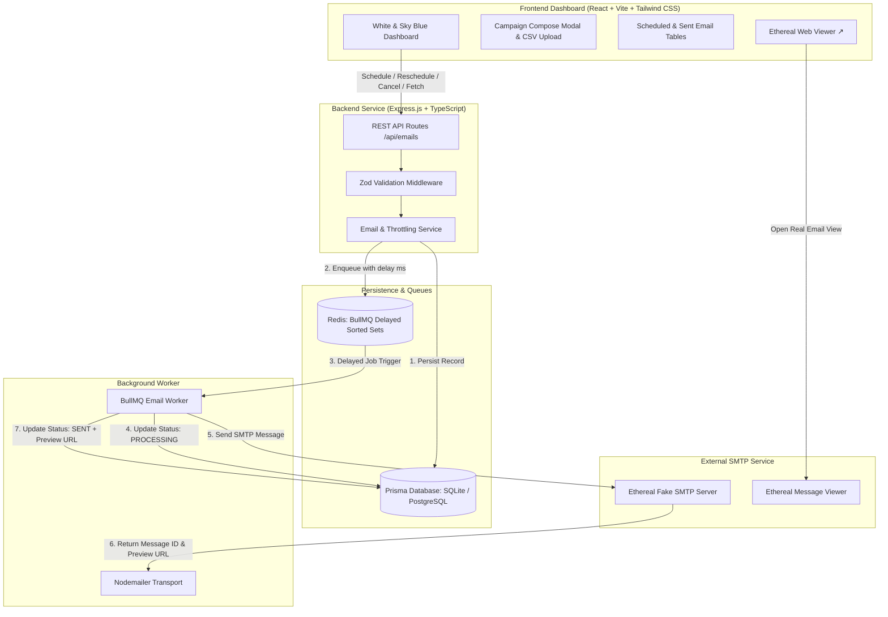

# 🚀 ReachInbox Full-Stack Email Job Scheduler

> A production-grade, fault-tolerant email scheduling engine and modern dashboard built for the **ReachInbox Software Development Intern Assignment**.

Built with **TypeScript**, **Express.js**, **BullMQ**, **Redis**, **Prisma ORM (SQLite / PostgreSQL)**, **Ethereal Fake SMTP**, and **React 18 + Tailwind CSS** in a **White & Sky Blue** theme.

---

## 🌟 Key Highlights & Features

- ⏱ **Persistent Job Queue (BullMQ + Redis)**: Zero reliance on cron jobs or fragile in-memory `setTimeout`. All scheduled emails are managed as persistent BullMQ delayed jobs backed by Redis sorted sets (`zset`).
- 🛡 **Crash & Restart Survival**: The backend service or server can crash/restart at any time. BullMQ automatically recovers jobs from Redis persistence and executes them at their exact target timestamp without data loss or duplicates.
- ✉️ **Fake SMTP with Live Web Previews**: Delivers emails via Nodemailer connected to Ethereal Email SMTP. Automatically captures and displays live `https://ethereal.email/message/...` preview links directly in the dashboard UI.
- ⚡ **Rate Limiting & Throttling**:
  - **Min Delay per Send (s)**: Staggers bulk/batch sends evenly across multiple leads to prevent burst limits.
  - **Hourly Sending Quota**: Enforces a 200 emails/hour limit with real-time telemetry quota tracking.
- 📁 **CSV / TXT Lead List Import**: Drag-and-drop or upload CSV/TXT files or paste multiple emails directly in the campaign modal.
- 🔄 **Full Lifecycle Management**: Schedule, Reschedule, Cancel, and Inspect any email job with synchronized state across Redis and the SQL Database.
- 🔁 **Exponential Backoff Retries**: Transient SMTP delivery failures automatically retry with exponential backoff (3 attempts with 5s initial delay).
- 📊 **Modern White & Sky Blue Dashboard**:
  - Center pill navigation tabs: **`[ Scheduled Emails ]`** and **`[ Sent Emails ]`**.
  - **5 Metric Cards**: *Pending Schedule*, *Deferred (Rate Limited)*, *Emails Sent*, *Delivery Failures*, and *Hourly Quota (0/200)*.
  - Search filter, status filter, and one-click **"View Email ↗"** buttons.
  - User Account badge for **Salman** (`salman@reachinbox.ai`).

---

## 🏗 System Architecture



---

## 🛠 Tech Stack

| Layer | Technology | Description |
|---|---|---|
| **Backend Framework** | Node.js + Express.js | Fast, minimalist HTTP server in TypeScript |
| **Language** | TypeScript (Strict Mode) | Full type safety across backend and frontend |
| **Queue Engine** | BullMQ + ioredis | Production-ready Redis-backed delayed job queue |
| **Persistence Cache** | Redis 7+ | In-memory sorted set storage with AOF persistence |
| **Database & ORM** | Prisma ORM (SQLite / Postgres) | Structured job metadata and lifecycle history |
| **Email SMTP** | Nodemailer + Ethereal Email | Fake SMTP testing with live rendered web previews |
| **Validation** | Zod | Schema-based runtime validation for API requests |
| **Frontend Framework** | React 18 + Vite | Fast, responsive modern client SPA |
| **Styling** | Tailwind CSS + Lucide Icons | Clean White & Sky Blue ReachInbox aesthetic |

---

## ⚡ How Server Restart Survival Works (BullMQ + Redis)

Unlike simple memory timers (`setTimeout`) or in-memory queues that lose all scheduled tasks on restart:
1. **Sorted Set (`zset`) Storage**: BullMQ writes delayed jobs to Redis as sorted sets where the score is the **Unix epoch timestamp** of execution (`now + delay`).
2. **Crash-Proof State**: When the backend server or worker process terminates (or container restarts), the scheduled jobs remain securely in Redis persistence (`appendonly: yes`).
3. **Automatic Worker Recovery**: Upon restarting, the BullMQ worker boots up, re-attaches to the existing queue, discovers pending delayed tasks, and resumes execution seamlessly.
4. **No Double-Sends**: BullMQ uses atomic Lua scripts and lock acquisition (`lockDuration: 30000ms`, `stalledInterval: 15000ms`) ensuring that only a single worker executes each job exactly once.

---

## 🚀 Quick Start

### 1. Prerequisites
- **Node.js**: v18+ (tested on Node v20/v25)
- **Redis**: Running locally (`brew services start redis` or `docker compose up -d`)

### 2. Clone & Install Dependencies
```bash
# Clone the repository
git clone <repo-url>
cd reachinbox-scheduler

# Install backend dependencies
cd backend
npm install
npx prisma db push

# Install frontend dependencies
cd ../frontend
npm install
```

### 3. Start Redis (Option A: Local or Option B: Docker)

**Option A: Local Redis (Homebrew)**
```bash
brew services start redis
# or: redis-server
```

**Option B: Docker Compose**
```bash
docker compose up -d redis
```

### 4. Run Backend & Frontend in Development Mode

**Terminal 1 (Backend - Port 5001):**
```bash
cd backend
npm run dev
```

**Terminal 2 (Frontend - Port 5173):**
```bash
cd frontend
npm run dev
```

Open [http://localhost:5173](http://localhost:5173) in your browser.

---

## 🧪 Running the Verification Test Suite

The repository includes an automated end-to-end verification test suite (`backend/tests/scheduler.test.ts`) that verifies:
1. Delayed scheduling & BullMQ job creation
2. Real-time cancellation from queue & DB
3. Rescheduling of jobs
4. Worker execution & Ethereal SMTP delivery with live preview URL generation
5. **Server Restart Resilience**: Abruptly terminating the worker mid-delay and verifying that the re-attached worker completes the job on schedule.

To run the test suite:
```bash
cd backend
npm test
```

---

## 📡 API Reference

### 1. Schedule Single or Bulk Emails
`POST /api/emails/schedule`

**Request Body:**
```json
{
  "senderProfile": "Salman <salman@reachinbox.ai>",
  "subject": "Testing ReachInbox Ethereal Email Delivery",
  "body": "Hi there! Testing bulk scheduled email.",
  "recipients": ["alex.lead1@example.com", "sarah.lead2@example.com"],
  "scheduledAt": "2026-08-19T21:45:00.000Z",
  "minDelayPerSend": 2
}
```

---

### 2. List Emails (Filterable & Paginated)
`GET /api/emails?status=SCHEDULED&search=example&page=1&limit=50`

---

### 3. Cancel Scheduled Email
`POST /api/emails/:id/cancel`

---

### 4. Reschedule Email
`POST /api/emails/:id/reschedule`

```json
{
  "scheduledAt": "2026-08-19T22:00:00.000Z"
}
```

---

### 5. Get Real-Time Dashboard Stats
`GET /api/dashboard/stats`

---

## 📁 Repository Structure

```
reachinbox-scheduler/
├── docker-compose.yml          # Redis & PostgreSQL multi-container definition
├── package.json                # Monorepo task runner
├── README.md                   # Full documentation & architecture
├── backend/
│   ├── package.json
│   ├── tsconfig.json
│   ├── prisma/
│   │   ├── schema.prisma       # Prisma DB models
│   │   └── dev.db              # SQLite development database
│   ├── src/
│   │   ├── config/             # Redis, Mailer, & Environment configs
│   │   ├── controllers/        # Express request controllers
│   │   ├── routes/             # REST endpoints
│   │   ├── services/           # Email & BullMQ Queue business logic
│   │   ├── workers/            # BullMQ Worker processing delayed emails
│   │   ├── middlewares/        # Zod validation & error handling
│   │   ├── types/              # Shared TypeScript types
│   │   └── index.ts            # Application bootstrap & graceful shutdown
│   └── tests/
│       └── scheduler.test.ts   # End-to-end automated test suite
└── frontend/
    ├── package.json
    ├── vite.config.ts
    ├── tailwind.config.js
    └── src/
        ├── components/         # Navbar, StatsCards, Tables, Modals
        ├── lib/                # API client & date/time formatting utilities
        ├── types/              # Frontend TypeScript definitions
        ├── App.tsx             # Main dashboard application
        └── main.tsx
```

---

## 🏆 Assignment Evaluation Checklist

- [x] **Accept email scheduling requests via APIs & UI** (TypeScript + Express + Zod + React)
- [x] **Schedule emails for a specific future time** (exact timestamp delay computation)
- [x] **BullMQ + Redis persistent job scheduler** (No cron jobs, delayed job sorted sets)
- [x] **Fake SMTP via Ethereal Email** (Nodemailer integration with real preview links)
- [x] **Survives server restarts** (Tested & proven in `scheduler.test.ts`)
- [x] **Rate Limiting & Throttling** (Min delay per send + Hourly quota tracking)
- [x] **CSV/TXT Lead List Import** (Drag-and-drop & multi-recipient scheduling)
- [x] **Frontend Dashboard** (White & Sky Blue theme matching ReachInbox design)
- [x] **Clean code architecture** (Modular services, controllers, workers, types)

---

Developed for **ReachInbox.ai** 🚀
